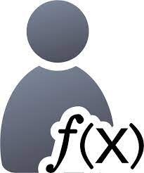

#  UDF-RUN

<a href="https://www.legosoft.com.mx"></a>
Microservice that runs un Python all User Defined Functions (UDFs)acts. The Python code is set by the microservice
`udf-ui`, for each UDF. The Python code is defined  is to defined in the `udf-ui` using the function in a `Blockly` 
manner and translates as `Python` code (the end user does not require `Python` knowledge).

The `udf-run` microservice is the one that executes the `udf` and is called from any UI.

# UI for the definition of User Define Functions(UDF) 

The UDFs functionality is composed by three microservices: `udf-ui`, `udf-service` and `udf-run` (in Python).

The UDF functionality consists in the extension of a data model with extra derived attributes that can be programmed
without the need to ad code, reprogram or re-install eny microservices. This is done by what we define as `power users`
but they do not need to have any programming experience. 

They could be compared as macros for a spreadsheets but inside the AI Legorreta Market Pl.

## Introduction

User defined functions (UDFs) is a way to extend the financial data model without the need to modify or add code to
the system.

The steps to create a new UDf are the following:

- Create a new UDF in this microservice `udf-ui` where the end user defines the input parameters in order to do some
calculations and produce a result.
- In this same fron `udf-ui` the end user defines the fields mapping from the input parameters of the UDF and the 
fields defined in a `datasource`.
- A `datasource` are a group of attributes that a microservice exports. This microservice support UDFs.
- In this microservice `udf-ui` also the end user can define the calculations needed in `Blockly` format that it is
translated to a `Python` code and store in a file to be read and executed by the `udf-run`.
- In the microservices where the `datasource` is defined and exported can be added in any Vaadin component like a 
grid or any textFiled in a Vaadin form or even a report.  
- The UDF calls the microservice `udf-run` is the piece of software that calls the `Python` function and returns the
result to the microservice.

note: Since `Python` is an interpreted language no recompile, or re-initialization of `udf` is needed, it is done
on-line and no coding is necessary.

## Python project as a microservice:

For more information to create a Python project as a microservice see::

https://github.com/tiangolo/uwsgi-nginx-flask-docker

## Example for a UDF

Several UDFs are defined inside the `cartera` demonstration microservice:

- In the portfolio grid component we add an extra column that it gives a grade for the instrument. The UDF is called
'Calific_Actinver'.
- Another UDF fo create a new textField inside the form that list a detail of the cash movement. The UDf is called
'Mov-efectivo'
- Two microservices are define `cartera` and `ingestor`.

note: The database `udfdb` is initialized with these data by the `udf-service` microservice.


## Port availability

This is to detect port availability (for any micro.service is usefull)

```
sudo nc localhost 7076 < /dev/null; echo $?
```


## Compilation 

If we want to crate a new docker

```bash
sudo bash start.sh
```

Or build the image in this two steps:

(step 1) Build the image:

```
docker build -t udf-run .    
```

(step 2) Build the container

```
docker run -d -p 7076:80 --name=udf-run -v $PWD:/app udfrun
```

## Run the container

And to run an already created docker :

```bash
docker start udf-run
```

To stop the docker

```bash
docker stop udf-run
```

## Update the code without shutting down the container

When we want to update the Python code:

```bash
sudo touch uwsgi.ini
```

## More information

See links:

https://www.digitalocean.com/community/tutorials/how-to-build-and-deploy-a-flask-application-using-docker-on-ubuntu-18-04

Or for Python Flask see:

https://programminghistorian.org/en/lessons/creating-apis-with-python-and-flask


### Contact AI Legorreta

Feel free to reach out to AI Legorreta on [web page](https://legosoft.com.mx).


Version: 2.0.0
©LegoSoft Soluciones, S.C., 2023

